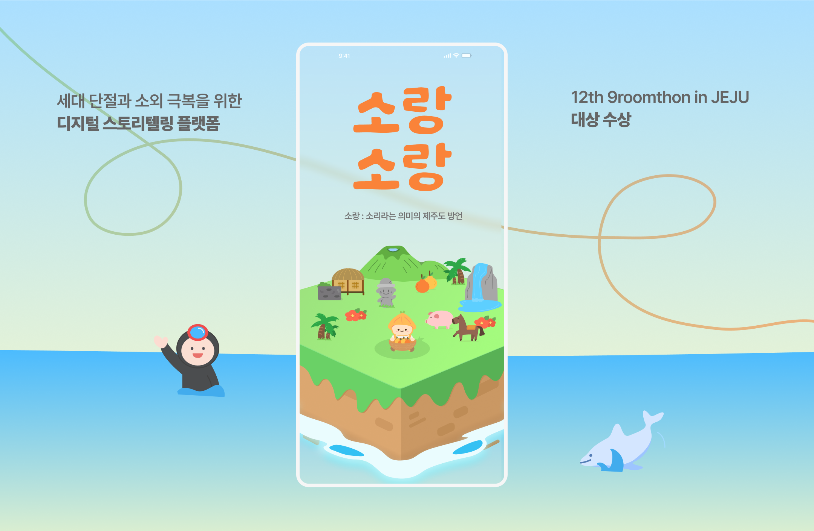
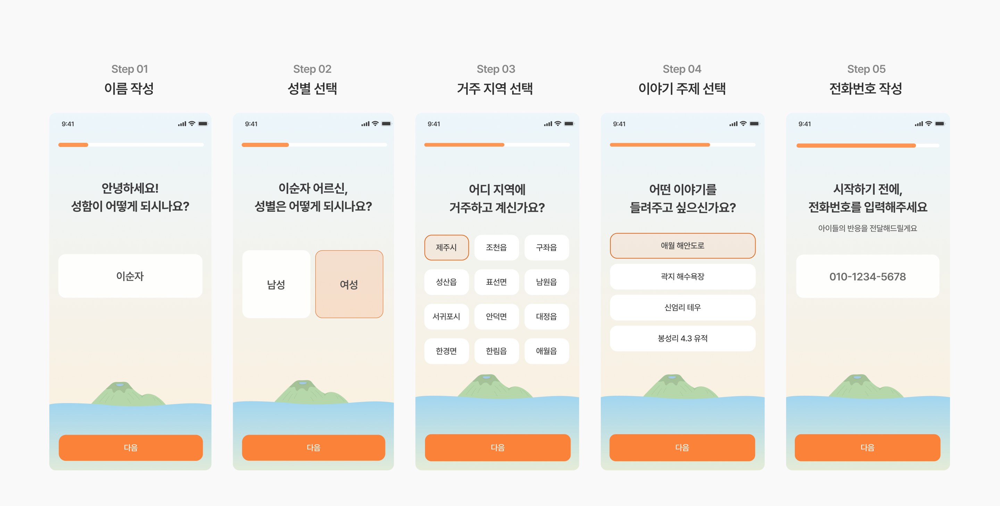
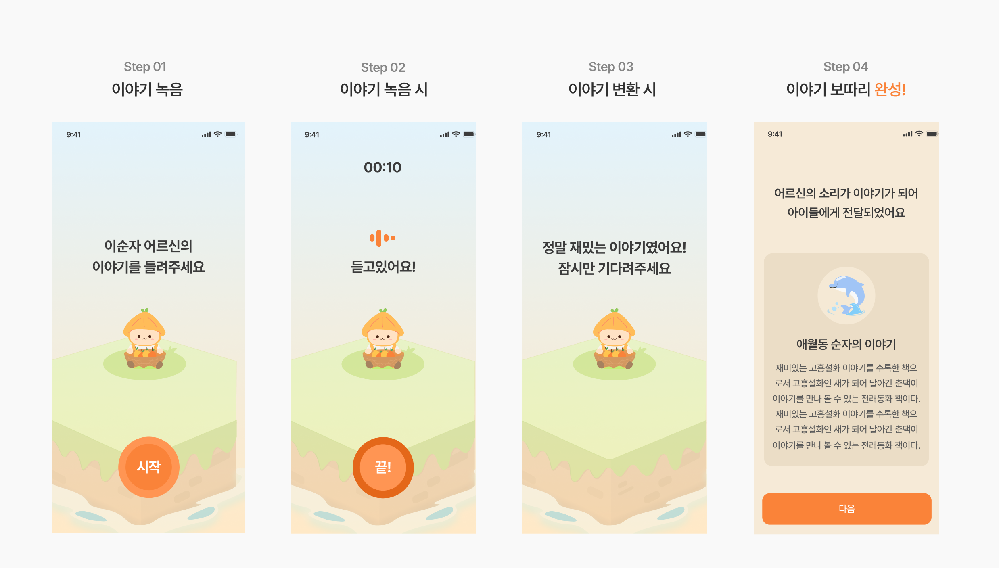
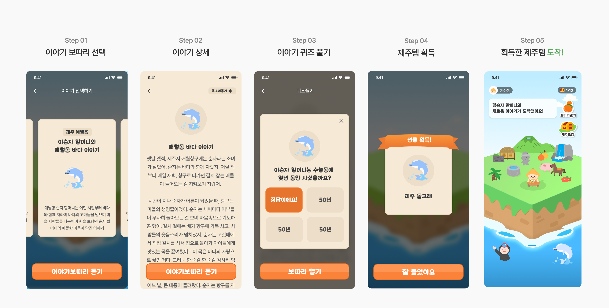
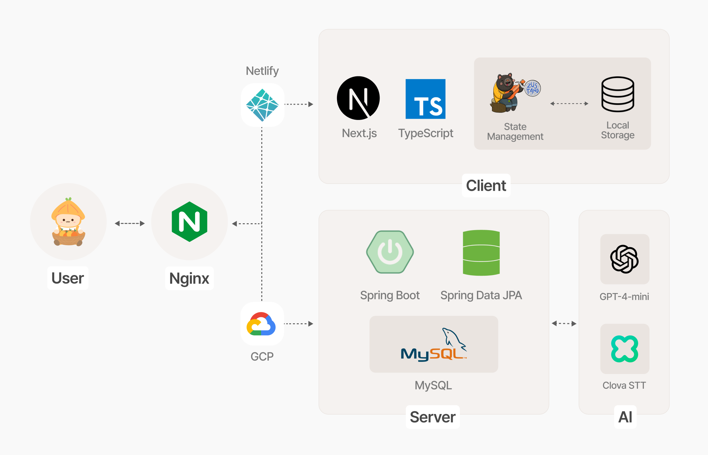

## 목차

1. [**프로젝트 개요**](#프로젝트-개요)
2. [**서비스 소개**](#서비스-소개)
3. [**서비스 기능**](#서비스-기능)
4. [**핵심 기술**](#핵심-기술)
5. [**아키텍쳐**](#아키텍쳐)

 
 

## 프로젝트 개요

🥇 **kakao x goorm 구름톤 12기 대상**

🍀 **TEAM 수놀음** : 한주성 (PM), 김주리 (Design), [박유주](https://github.com/youjuice) (FE), 
[복준우](https://github.com/bokjunwoo) (FE), [신창혁](https://github.com/Hugh-KR) (BE)

### 기술 스택
| 분류               | 기술                                                                                                                                                                                                                                                                                                                                                                                                                                                     | 
|------------------|--------------------------------------------------------------------------------------------------------------------------------------------------------------------------------------------------------------------------------------------------------------------------------------------------------------------------------------------------------------------------------------------------------------------------------------------------------|
| **Frontend**     |     |
| **Backend**      |                                                                                                                |
| **Infra/Devops** |                                                                                                            |
| **AI Services**  |                                                                                                                                                                                                                                       |

 

## 서비스 소개
> **소랑소랑** (/so-rang/ : 제주 방언으로 '**소리**'를 의미)  
> 고령층의 소중한 이야기가 AI 기술을 만나
> 어린 세대를 위한 새로운 이야기로 피어나는 **디지털 스토리텔링 서비스**

☁️ **구름톤 전시관**: [바로가기]()

🔗 **Visit Our Service!**
- [이야기 보따리 담기](https://sorang.site/master) (Senior 👵🏻)
- [이야기 보따리 풀기](https://sorang.site/) (Kids 🧒🏻)

 

## 서비스 기능
### 이야기 보따리 담기 (Senior 👵🏻)

 

### 이야기 보따리 풀기 (Kids 🧒🏻)

 

## 핵심 기술
### 📔 이야기의 시작 (공통)
- React Hook Form + Zod 기반의 견고한 폼 검증
- Zustand와 Local Storage를 활용한 전역 상태 관리
- 지역별 맞춤형 키워드 시스템

### 👵🏻 음성에서 동화로 피어나는 이야기 (Senior)
- 실시간 오디오 시각화로 녹음 상태 피드백
- Clova STT API 연동으로 음성-텍스트 변환
- Gpt-4 기반 동화 및 교육용 퀴즈 생성

### 🧒🏻 할머니가 들려주는 제주 이야기 (Kids)
- 이야기 기반 퀴즈 풀이 시스템
- 퀴즈 정답 시 지역별 제주 아이템 제공
- 지역 문화 학습을 위한 인터랙티브 UI/UX

 

## 아키텍쳐

